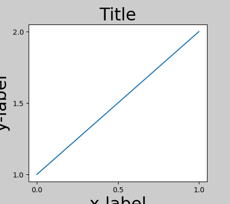
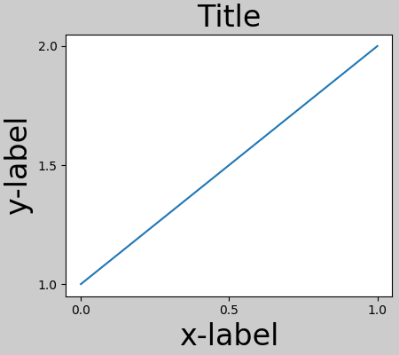
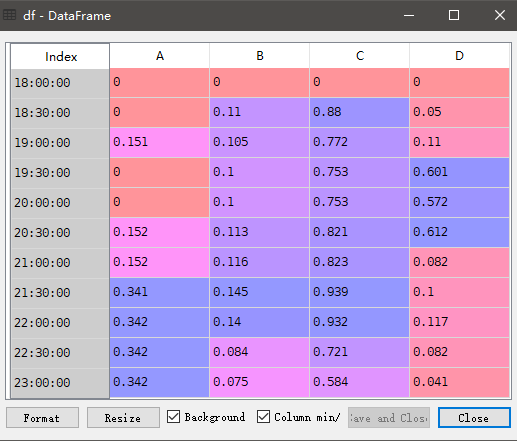
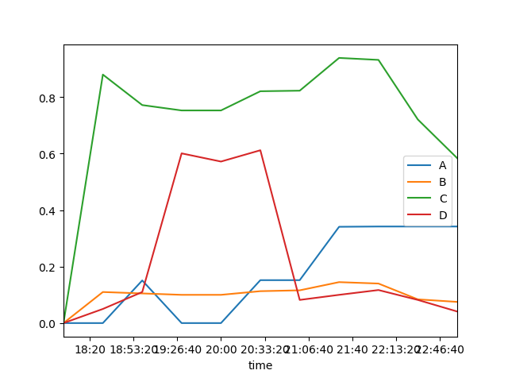
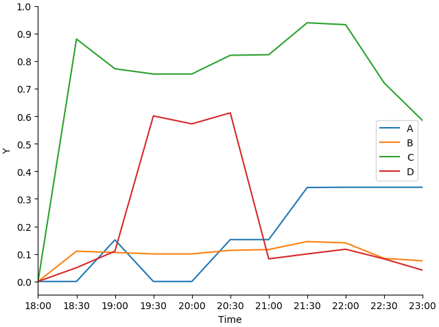

# Python3.matplotlib绘图琢磨01

其实网上介绍matplotlib简单绘图的教程已经很多了，我来补充一些我认为比较好的习惯和小技巧。

---

开始之前先导入matplotlib和他的小伙伴：
```python
import numpy as np
import pandas as pd
import matplotlib.pyplot as plt
```

## 手动生成figure和axes
不手动生成figure和axes的情况下，也可以通过`plt.plot()`等函数直接绘图，此时figure和axes都是自动生成的，但这并不是好习惯。我认为手动生成figure和axes将有助于控制细节，像这样：
```python
fig = plt.figure("fig01")
ax = plt.axes()
```
如果你经常看官网示例图的示例代码会发现有这样的写法：
```python
fig, ax = plt.subplots()
```
这两种都实现了手动生成figure和axes。虽然第二种看上去更简单，但是figure和axes两种对象的详细参数同时传入会有混乱感，所以我更喜欢第一种figure和axes泾渭分明的写法。

## 布局控制
给`plt.figure()`传参可以实现一些常见的布局控制：
```python
fig = plt.figure("fig01",
                 figsize=[6,4],
                 dpi=300,
                 constrained_layout=True)
```
其中`figsize`的单位为英寸。`constrained_layout`设为True表示采用约束布局，这将会调整各部件到最合适的位置和比例



但是要注意的是，官网说`constrained_layout`是实验性质的功能，可能会被移除，功能相似的`tight_layout `也是实验性质的功能但并没有说可能会被移除，实测前者比后者会更充分地利用空间即边角空白更小，所以用于论文出图的话尽可能用`constrained_layout`吧。

但要是这两个功能将来被砍掉呢？那只能手动调整绘图区域等来进行布局控制了：
```python
fig = plt.figure("fig01")
ax = plt.axes([0.2, 0.3, 0.7, 0.6])
```
其中传给`plt.axes()`的4元序列控制的是绘图区域【距离左边，距离底边，宽，高】的比例。其他部件都类似慢慢调整就是了。

## 接管pandas绘图
假设从一个Excel中读取了一个DataFrame如图所示：


执行`df.plot()`可以很方便地得到:


可以发现刻度值不够美观、横纵坐标标题需要设置等等需要问题，这些问题有的可以通过`df.plot()`返回的axes对象来解决，有的可以通过给`df.plot()`传参来解决，但是例如dpi、constrained_layout等无法设置了。这时事先手动生成figure和axes就显现出优势了：
```python
fig = plt.figure("fig6", constrained_layout=True, dpi=200)
ax = plt.axes()
style = [f"k{m}-" for m in ['', 'o', 's', '^']]
df.plot(ax=ax, style=style)
ax.set_xlabel("Time")
ax.set_ylabel("Y")
ax.set_xticks(df.index)
ax.set_yticks(np.arange(0, 1.1, 0.1))
ax.spines["top"].set_color("none")  # 不显示上框线
ax.spines["right"].set_color("none")  # 不显示右框线
```

其实由此可以看出pandas的绘图功能仅仅是用来快速可视化的，绘制要求高一些的图需要动用更底层的matplotlib。

---

出图其实是一件挺麻烦的事，matplotlib绘图的坑也不少，比如中文设置、图片保存格式等等，以后慢慢写。

