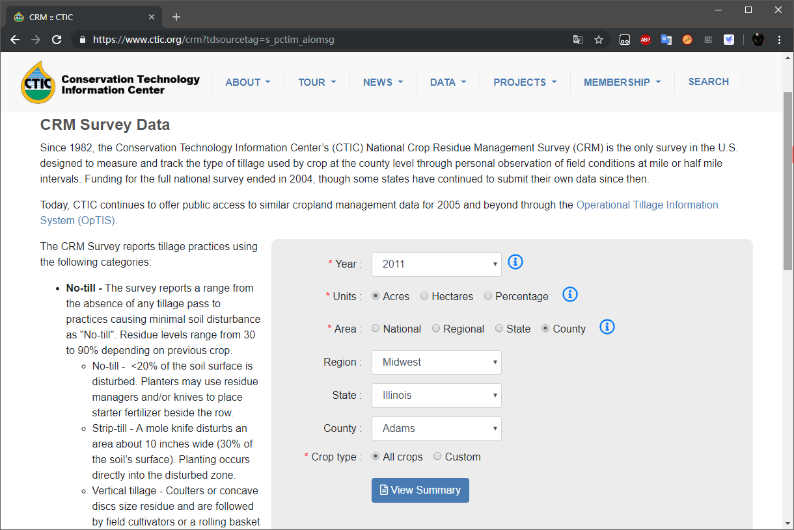
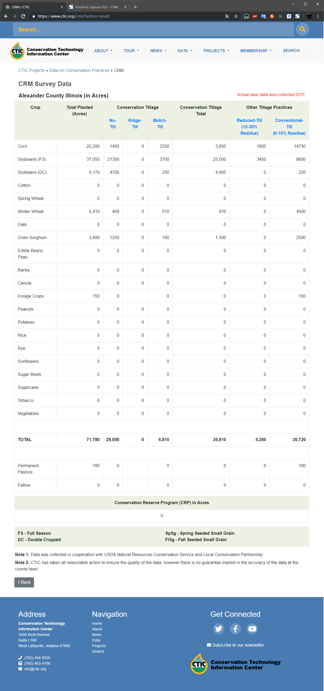
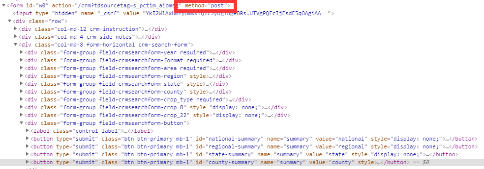
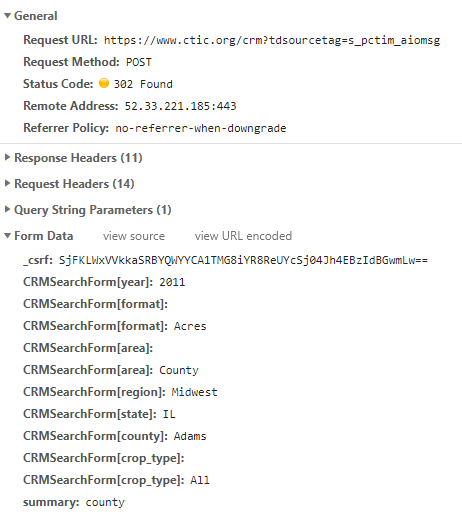
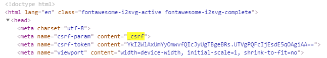
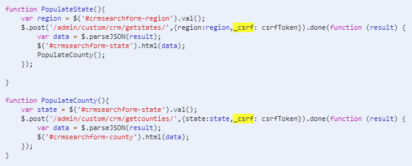
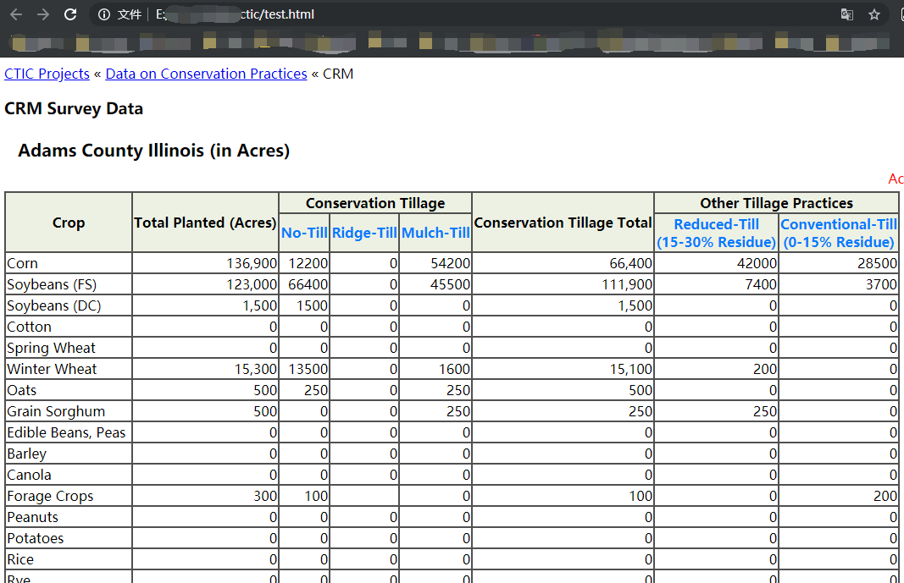
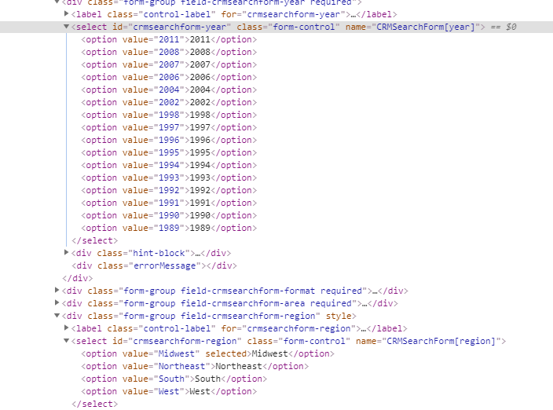
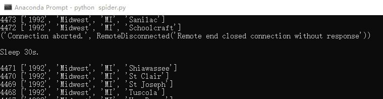

# Python3.模拟表单提交、爬取表格数据

> 主要内容有：<br>
通过requests库模拟表单提交<br>
通过pandas库提取网页表格

上周五，大师兄发给我一个网址，哭哭啼啼地求我：“去！把这个网页上所有年所有县所有作物的数据全爬下来，存到Access里！”

我看他可怜，勉为其难地挥挥手说：“好嘞，马上就开始！”

---

## 目标分析

大师兄给我的网址是这个：https://www.ctic.org/crm?tdsourcetag=s_pctim_aiomsg

打开长这样：


根据我学爬虫并不久的经验，通常只要把年月日之类的参数附加到url里面去，然后用`requests.get`拿到`response`解析html就完了，所以这次应该也差不多——除了要先想办法获得具体有哪些年份、地名、作物名称，其他部分拿以前的代码稍微改改就能用了，毫无挑战性工作，生活真是太无聊了

点击 `View Summary` 后出现目标网页长这样


那个大表格的数据就是目标数据了，好像没什么了不起的——

有点不对劲

目标数据所在网页的网址是这样的：https://www.ctic.org/crm/?action=result ，刚刚选择的那些参数并没有作为url的参数啊！网址网页都变了，所以也不是ajax

这和我想象的情况有~~巨大~~差别啊

## 尝试获取目标页面

让我来康康点击`View Summary`这个按钮时到底发生了啥：右键`View Summary`检查是这样：


实话说，这是我第一次遇到要提交表单的活儿。以前可能是上天眷顾我，统统`get`就能搞定，今天终于让我碰上一个`post`了。

点击`View Summary`，到DevTools里找network第一条：


不管三七二十一，`post`一下试试看
```python
import requests

url = 'https://www.ctic.org/crm?tdsourcetag=s_pctim_aiomsg'
headers = {'user-agent': 'Mozilla/5.0 (Windows NT 10.0; Win64; x64) '
           'AppleWebKit/537.36 (KHTML, like Gecko) '
           'Chrome/74.0.3729.131 Safari/537.36',
           'Host': 'www.ctic.org'}
data = {'_csrf': 'SjFKLWxVVkkaSRBYQWYYCA1TMG8iYR8ReUYcSj04Jh4EBzIdBGwmLw==',
        'CRMSearchForm[year]': '2011',
        'CRMSearchForm[format]': 'Acres',
        'CRMSearchForm[area]': 'County',
        'CRMSearchForm[region]': 'Midwest',
        'CRMSearchForm[state]': 'IL',
        'CRMSearchForm[county]': 'Adams',
        'CRMSearchForm[crop_type]': 'All',
        'summary': 'county'}
response = requests.post(url, data=data, headers=headers)
print(response.status_code)
```

果不其然，输出`400`……我猜这就是传说中的`cookies`在搞鬼吗？《Python3网络爬虫实战》只看到第6章的我不禁有些~~心虚~~跃跃欲试呢！

首先，我搞不清`cookies`具体是啥，只知道它是用来维持会话的，应该来自于第一次`get`，搞出来看看先：
```python
response1 = requests.get(url, headers=headers)
if response1.status_code == 200:
    cookies = response1.cookies
    print(cookies)
```
输出：
```
<RequestsCookieJar[<Cookie PHPSESSID=52asgghnqsntitqd7c8dqesgh6 for www.ctic.org/>, <Cookie _csrf=2571c72a4ca9699915ea4037b967827150715252de98ea2173b162fa376bad33s%3A32%3A%22TAhjwgNo5ElZzV55k3DMeFoc5TWrEmXj%22%3B for www.ctic.org/>]>
```
Nah，看不懂，不看不管，直接把它放到`post`里试试
```python
response2 = requests.post(url, data=data, headers=headers, cookies=cookies)
print(response2.status_code)
```
还是`400`，气氛突然变得有些焦灼，我给你`cookies`了啊，你还想要啥？！

突然，我发现一件事：`post`请求所带的`data`中那个一开始就显得很可疑的`_csrf`我仿佛在哪儿见过？

那个我完全看不懂的`cookies`里好像就有一个`_csrf`啊！但是两个`_csrf`的值很明显结构不一样，试了一下把`data`里的`_csrf`换成`cookies`里的`_csrf`确实也不行。

但是我逐渐有了一个想法：这个两个`_csrf`虽然不相等，但是应该是匹配的，我刚刚的`data`来自浏览器，`cookies`来自python程序，所以不匹配！

于是我又点开浏览器的DevTools，Ctrl+F搜索了一下，嘿嘿，发现了：

和

这三处。

第一处那里的下一行的`csrf_token`很明显就是`post`请求所带的`data`里的`_csrf`，另外两个是js里的函数，虽然js没好好学但也能看出来这俩是通过`post`请求获得州名和县名的，Binggo！一下子解决两个问题。

为了验证我的猜想，我打算先直接用requests获取点击`View Summary`前的页面的HTML和`cookies`，将从HTML中提取的`csrf_token`值作为点击`View Summary`时`post`请求的`data`里的`_csrf`值，同时附上`cookies`，这样两处`_csrf`就应该是匹配的了：
```python
from lxml import etree
response1 = requests.get(url, headers=headers)
cookies = response1.cookies
html = etree.HTML(response1.text)
csrf_token = html.xpath('/html/head/meta[3]/@content')[0]
data.update({'_csrf': csrf_token})
response2 = requests.post(url, data=data, headers=headers, cookies=cookies)
print(response2.status_code)
```
输出`200`，虽然和Chrome显示的`302`不一样，但是也表示成功，那就不管了。把`response2.text`写入html文件打开看是这样：


Yeah，数据都在！说明我的猜想是对的！那一会再试试我从没用过的`requests.Session()`维持会话，自动处理`cookies`。

## 尝试pandas库提取网页表格

现在既然已经拿到了目标页面的HTML，那在获取所有年、地区、州名、县名之前，先测试一下`pandas.read_html`提取网页表格的功能。

`pandas.read_html`这个函数时在写代码时IDE自动补全下拉列表里瞄到的，一直想试试来着，今天乘机拉出来溜溜：
```python
import pandas as pd
df = pd.read_html(response2.text)[0]
print(df)
```
输出：


Yeah！拿到了，确实比自己手写提取方便，而且数值字符串自动转成数值，优秀！

## 准备所有参数

接下来要获取所有年、地区、州名、县名。年份和地区是写死在HTML里的，直接xpath获取：


州名、县名根据之前发现的两个js函数，要用`post`请求来获得，其中州名要根据地区名获取，县名要根据州名获取，套两层循环就行

```python
def new():
    session = requests.Session()
    response = session.get(url=url, headers=headers)
    html = etree.HTML(response.text)
    return session, html

session, html = new()
years = html.xpath('//*[@id="crmsearchform-year"]/option/text()')
regions = html.xpath('//*[@id="crmsearchform-region"]/option/text()')
_csrf = html.xpath('/html/head/meta[3]/@content')[0]
region_state = {}
state_county = {}
for region in regions:
    data = {'region': region, '_csrf': _csrf}
    response = session.post(url_state, data=data)
    html = etree.HTML(response.json())
    region_state[region] = {x: y for x, y in
                            zip(html.xpath('//option/@value'),
                                html.xpath('//option/text()'))}
    for state in region_state[region]:
        data = {'state': state, '_csrf': _csrf}
        response = session.post(url_county, data=data)
        html = etree.HTML(response.json())
        state_county[state] = html.xpath('//option/@value')
```

啧啧，使用`requests.Session`就完全不需要自己管理`cookies`了，方便！具体获得的州名县名就不放出来了，实在太多了。然后把所有年、地区、州名、县名的可能组合先整理成csv文件，一会直接从csv里读取并构造`post`请求的`data`字典：
```python
remain = [[str(year), str(region), str(state), str(county)] 
         for year in years for region in regions
         for state in region_state[region] for county in state_county[state]]
remain = pd.DataFrame(remain, columns=['CRMSearchForm[year]',
                                       'CRMSearchForm[region]',
                                       'CRMSearchForm[state]',
                                       'CRMSearchForm[county]'])
remain.to_csv('remain.csv', index=False)
# 由于州名有缩写和全称，也本地保存一份
import json
with open('region_state.json', 'w') as json_file:
        json.dump(region_state, json_file, indent=4)
```
我看了一下，一共49473行——也就是说至少要发送49473个`post`请求才能爬完全部数据，纯手工获取的话大概要点击十倍这个数字的次数……

## 正式开始

那么开始爬咯
```python
import pyodbc
with open("region_state.json") as json_file:
    region_state = json.load(json_file)
data = pd.read_csv('remain.csv')
# 读取已经爬取的
cnxn = pyodbc.connect('DRIVER={Microsoft Access Driver (*.mdb, *.accdb)};'
                      'DBQ=./ctic_crm.accdb')
crsr = cnxn.cursor()
crsr.execute('select Year_, Region, State, County from ctic_crm')
done = crsr.fetchall()
done = [list(x) for x in done]
done = pd.DataFrame([list(x) for x in done], columns=['CRMSearchForm[year]',
                                                      'CRMSearchForm[region]',
                                                      'CRMSearchForm[state]',
                                                      'CRMSearchForm[county]'])
done['CRMSearchForm[year]'] = done['CRMSearchForm[year]'].astype('int64')
state2st = {y: x for z in region_state.values() for x, y in z.items()}
done['CRMSearchForm[state]'] = [state2st[x]
                                for x in done['CRMSearchForm[state]']]
# 排除已经爬取的
remain = data.append(done)
remain = remain.drop_duplicates(keep=False)
total = len(remain)
print(f'{total} left.\n')
del data

# %%
remain['CRMSearchForm[year]'] = remain['CRMSearchForm[year]'].astype('str')
columns = ['Crop',
           'Total_Planted_Acres',
           'Conservation_Tillage_No_Till',
           'Conservation_Tillage_Ridge_Till',
           'Conservation_Tillage_Mulch_Till',
           'Conservation_Tillage_Total',
           'Other_Tillage_Practices_Reduced_Till15_30_Residue',
           'Other_Tillage_Practices_Conventional_Till0_15_Residue']
fields = ['Year_', 'Units', 'Area', 'Region', 'State', 'County'] + columns
data = {'CRMSearchForm[format]': 'Acres',
        'CRMSearchForm[area]': 'County',
        'CRMSearchForm[crop_type]': 'All',
        'summary': 'county'}
headers = {'user-agent': 'Mozilla/5.0 (Windows NT 10.0; Win64; x64) '
           'AppleWebKit/537.36 (KHTML, like Gecko) '
           'Chrome/74.0.3729.131 Safari/537.36',
           'Host': 'www.ctic.org',
           'Upgrade-Insecure-Requests': '1',
           'DNT': '1',
           'Connection': 'keep-alive'}
url = 'https://www.ctic.org/crm?tdsourcetag=s_pctim_aiomsg'
headers2 = headers.copy()
headers2 = headers2.update({'Referer': url,
                            'Origin': 'https://www.ctic.org'})
def new():
    session = requests.Session()
    response = session.get(url=url, headers=headers)
    html = etree.HTML(response.text)
    _csrf = html.xpath('/html/head/meta[3]/@content')[0]
    return session, _csrf
session, _csrf = new()
for _, row in remain.iterrows():
    temp = dict(row)
    data.update(temp)
    data.update({'_csrf': _csrf})
    while True:
        try:
            response = session.post(url, data=data, headers=headers2, timeout=15)
            break
        except Exception as e:
            session.close()
            print(e)
            print('\nSleep 30s.\n')
            time.sleep(30)
            session, _csrf = new()
            data.update({'_csrf': _csrf})

    df = pd.read_html(response.text)[0].dropna(how='all')
    df.columns = columns
    df['Year_'] = int(temp['CRMSearchForm[year]'])
    df['Units'] = 'Acres'
    df['Area'] = 'County'
    df['Region'] = temp['CRMSearchForm[region]']
    df['State'] = region_state[temp['CRMSearchForm[region]']][temp['CRMSearchForm[state]']]
    df['County'] = temp['CRMSearchForm[county]']
    df = df.reindex(columns=fields)
    for record in df.itertuples(index=False):
        tuple_record = tuple(record)
        sql_insert = f'INSERT INTO ctic_crm VALUES {tuple_record}'
        sql_insert = sql_insert.replace(', nan,', ', null,')
        crsr.execute(sql_insert)
        crsr.commit()
    print(total, row.to_list())
    total -= 1
else:
    print('Done!')
    crsr.close()
    cnxn.close()
```

注意中间有个`try...except..`语句，是因为不定时会发生`Connection aborted`的错误，有时9000次才断一次，有时一次就断，这也是我加上了`读取已经爬取的`和`排除已经爬取的`原因，而且担心被识别出爬虫，把`headers`写的丰富了一些（好像并没有什么卵用），并且每次断开都暂停个30s并重新开一个会话


然后把程序开着过了一个周末，命令行里终于打出了`Done!`，到Access里一看有816288条记录，心想：下次试试多线程（进程）和代理池。

---

周一，我把跑出来的数据发给大师兄，大师兄回我：“好的”

隔着屏幕我都能感受到滔滔不绝的敬仰和感激之情，于是淡淡地说：“师兄方便的话长按关注一下我的公众号哦，不定时有好玩的东西更新哦。”

<center>

</center>

然后一直到现在，大师兄都感动地说不出话来

