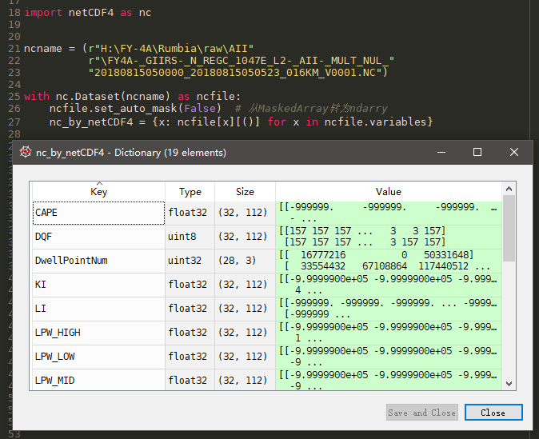
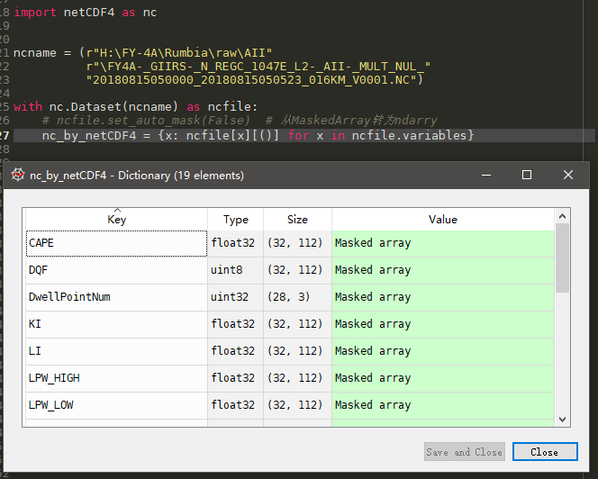

# Python3.读取nc和hdf的套路

> nc和hdf是一家人，5行Python代码一锅端

网上各种读取nc和hdf格式的教程很多，我总结了一个**简单暴力、性价比相当高**的套路，总共只要4~5行Python代码（核心代码只有2行），通吃netCDF3、netCDF4、hdf3、hdf4：

```Python
import netCDF4 as nc

filename = r"E:\whatever.nc"  # 也可以是hdf文件

with nc.Dataset(filename) as file:
    file.set_auto_mask(False)  # 可选
    variables = {x: file[x][()] for x in file.variables}
```

最终nc或hdf中的所有变量以字典的形式存在`variables`中了。

</center>

</center>

演示环境：

- python  3.7.2
- netcdf4 1.4.2

假如要读取hdf4格式的文件好像还要装`hdf4`库（我也记不得当时是自动安装的还是手动安装的了）。


## 讲解

- 这个套路依赖的主要是netCDF4的强大兼容性，在读取过程中自动判断文件的具体格式。
- `with`语句会自动关闭打开的文件，省去手动调用关闭方法的一行代码。
- 最后一行中`file.variables`是类似字典的视图，用在循环中遍历的就是是文件中的变量名。
- 最后一行中用字典解析式（有的教程里叫字典推导）压缩了循环遍历变量的代码。
- 最后一行中`[()]`获取变量的值是我从`h5py`的使用中学的，之所以不用更常用的`[:]`是因为在`h5py`中如果变量是标量会报`Illegal slicing argument for scalar dataspace`的错。虽然`netCDF4`中好像不存在这个问题，但是`[()]`体现了一种周全的思维，拿来用也不报错。
- 注释`可选`的那一行如果去掉，读出来的变量是numpyd的`MaskedArray`类型如下图，和正常`ndarray`几乎一样只不过增加了对缺测值的表示。我习惯打开矩阵看到数值所以有这一句，如果喜欢读出数据后用`matplotlib.pyplot.imshow()`迅速画个图看看的话可以把这一句去掉。

<center>

</center>

## 注意

- `filename`文件路径和文件名中不能有中文！而读hdf5的`h5py`却没有这个毛病，真是令人费解。
- 通常nc文件中除了`variables`还有`dimensions`和`groups`，如果需要的话将最后一行中的`file.variables`对应改一下。不过目前我接触到的文件中并没有人把数据放到`groups`里（想象成nc文件里的文件夹），而`dimensions`基本都是读文件前已知的，还是按需读取吧。

---

netCDF4格式支持多个无限维度，当有大量矩阵形式的数据（具体数据量又未知）要存取时可以把nc文件当成一个简易数据库，这就涉及到netCDF4写入操作了。下次再说~

**<center><font color=lime>喜欢的话请关注吧，天晓得还会更新什么不好玩儿的东西：</font></center>**

<center>

</center>
